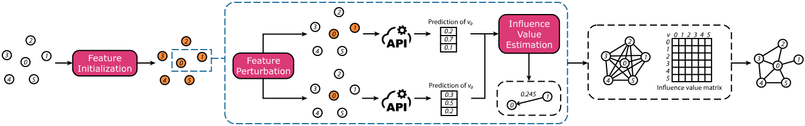

# Maui

This repository contains the source code for the paper, **"Maui: Black-Box Edge Privacy Attack on Graph Neural Networks"** by Haoyu He, Isaiah J. King and H. Howie Huang, presented at [PETS 2024](https://petsymposium.org/2024/).



[[Paper](https://doi.org/10.56553/popets-2024-0121)]

## Requirements

We use [Pytorch Geometric 2.4.0](https://pytorch-geometric.readthedocs.io/en/stable/) (PyG) and later for implementation. Please follow the instruction to install PyG.

## Datasets

The datasets can be directly loaded from PyG.

## Usage

### Configuring the experiment

We use `configs.py` to configure the experiment. Please check this file to see the complete list of options. 

### Specifications

The trained models are saved in the `./src` folder. 

The matrices of influence nodes and influence values are saved in the `./influence_values` folder, separated by datasets. They are saved as `.npz` files in `coo` format.

For small datasets, we run `*.py`. For large datasets, we run `*_sample.py`, which selects a random subgraph to attack in each round.

In the following sections, we provide simple commands for running the experiment on small datasets. 

### Training a GNN model

To train a target model, run the following:

```
python train.py --dataset DATASET_NAME --model MODEL_NAME
```

We provide GCN, GAT and GraphSAGE.

### Attacking a GNN model

To use Maui, simply run:

```
python get_influence_values.py --dataset DATASET_NAME --model MODEL_NAME --attacker 0
```

To use Maui_comb, run:

```
python get_influence_values.py --dataset DATASET_NAME --model MODEL_NAME --attacker 0 --combo --combo_bar THRESHOLD
```

We use `attacker` to specify which attacker to use, specifically, 0: Maui, 1: LinkTeller, 2: LSA2. 

### Evaluating the attack performance

`eval_baseline.py` can provide the all the evaluations from the paper. The command to run it is similar to running the attack, where you need to specify the dataset, model and the attack type. Additionally, you can specify `topk` for precision and recall.

`eval_k.py` can provide precisions and recalls at different `topk`.

We also provide the evaluation for decoders in `decode.py` and `decode_k`.
